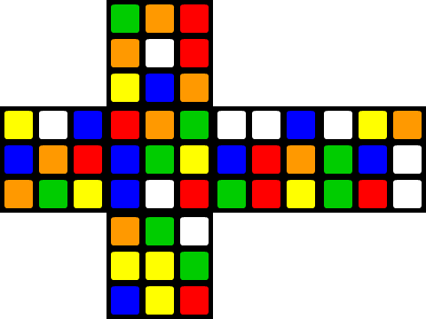

### 3x3x3 Cube arrangements

On a 3x3x3 cube, there are 6 faces, 8 corners and 12 edges. This gives us finite number of permutations or possible arrangements equal to 519,024,039,293,878,272,000.
But due to fixed center pieces, corner and edge arrangements; only **43,252,003,274,489,856,000** arrangements can be achieved on a solvable/legal cube. Each of these arrangements will represent an NFT.

Users can create a random arrangement, upload it and if its a unique yet valid image, they can mint an NFT with image hash as metadata.

Because there are _ONLY_ 43,252,003,274,489,856,000 of them, users can buy and sell existing cube arrangements.

### Image hash details

Consider the following image of an unfolded cube.


There are 54 total positions on a 3x3x3 cube, these are all assigned ascending numbers in a 'row first' manner starting from top left of front face. Faces are ordered as front, top, bottom, left, right and back.

For example the top left piece of front is 1 and second piece is 2. Similarly top left piece of top face is 10 then 11 and onwards.

On a 3x3x3 cube, six different colors are used for six faces. Each color is assigned a unique prime number in range of 53 to 5407.

_prime number choice is purely arbitrary_

example weightages can be:

| Color  | weightage |
| ------ | --------- |
| Red    | 73        |
| Green  | 79        |
| Blue   | 83        |
| White  | 89        |
| Yellow | 97        |
| Orange | 101       |

Colors weightage is multiplied to its position number and resulting numbers are added up to generate a `uint`.

Eventually this number is passed to `(hash160 uint)` which generates a unique hash value for combination.

Above image hash calculation should look something like this.

```lisp
(hash160 (+ (* 73 1) (* 101 2) (* 79 3) ...))
```

### Validating the arrangement

Before minting a token for a cube arrangement, we need to make sure that its a legal / solvable cube. **This is a _TODO_**...

- https://s3.eu-central-1.amazonaws.com/ucu.edu.ua/wp-content/uploads/sites/8/2020/11/Borkivskyy-Bohdan_188599_assignsubmission_file_Bachelor_Thesis_Bohdan_Borkivskyi.pdf

- https://math.stackexchange.com/questions/127577/how-to-tell-if-a-rubiks-cube-is-solvable

### Sources

- [The Mathematics of the Rubik’s Cube
  ](https://www.google.com/url?sa=t&rct=j&q=&esrc=s&source=web&cd=&ved=2ahUKEwiB0a3h8srzAhWDoFwKHdurAWYQFnoECCsQAQ&url=https%3A%2F%2Fweb.mit.edu%2Fsp.268%2Fwww%2Frubik.pdf&usg=AOvVaw2AXXUWWr4tSmWrEKpjmk5P)

### TODOs

- Market
  - Listings
  - Sale / Purchase
  - Collections
- test cases
- Upgradability
- Bidding
- Web work
- Legal cube?
